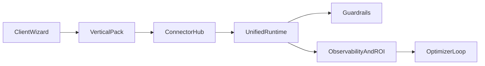

# Architecture cible coeur Agents

## Objectif

Fournir une experience client ultra simple, avec une complexite technique invisible, pour des resultats business mesurables.

## Principes

- Setup oriente objectif (pas oriente technique).
- Integrations standardisees et observables.
- Runtime unique pour l'execution des flows/actions.
- Guardrails metier et securite integres par defaut.
- Attribution ROI transparente (mesuree vs estimee).

## Flux cible

## Couches d'architecture

1. Experience Layer
- Wizard guide par outcomes (lead gen, support, conversion, retention).
- Templates verticaux preconfigures.

2. Integration Layer
- Hub unique: auth, mapping champs, health checks, retry policy, test payload.
- Catalogue connecteurs avec statut operationnel.

3. Execution Layer
- Orchestrateur unifie (deprecier les chemins d'execution redondants).
- Contrats stables pour actions/outils.

4. Guardrails Layer
- Politiques PII, seuil de confiance, handoff humain.
- ACL par role et audit des actions.

5. Observability Layer
- Traces conversation + action + integration.
- Dashboard business: conversions, resolution, cout, revenus attribues.

## Criteres de reussite

- Un client non technique peut deployer un agent operationnel en moins de 30 minutes.
- Connecteurs critiques activables sans intervention dev.
- Incidents et erreurs d'integration visibles et actionnables depuis le dashboard.
