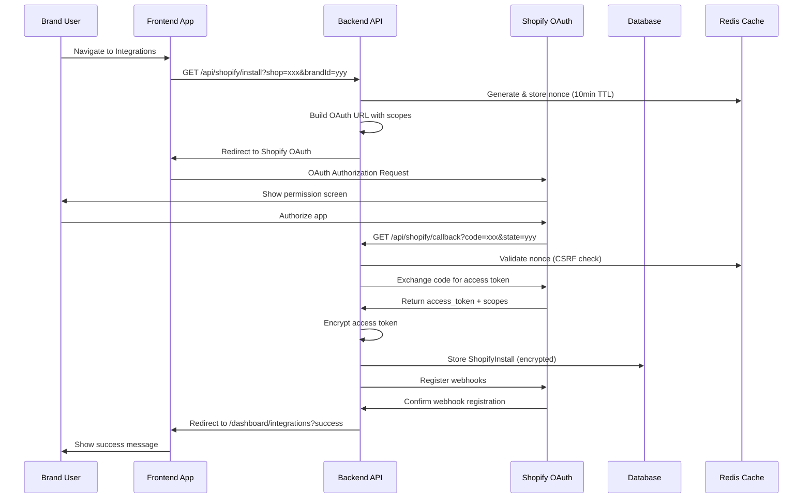
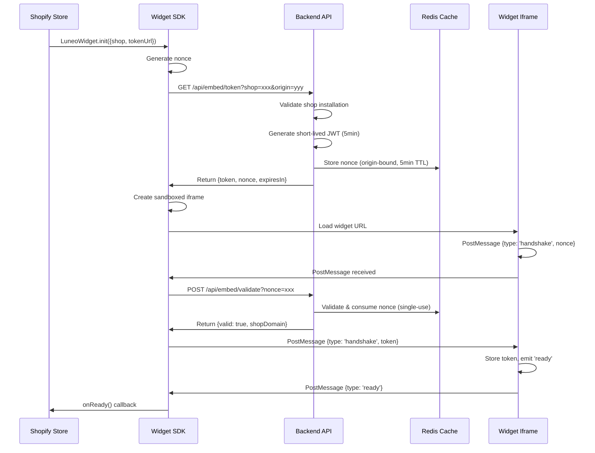
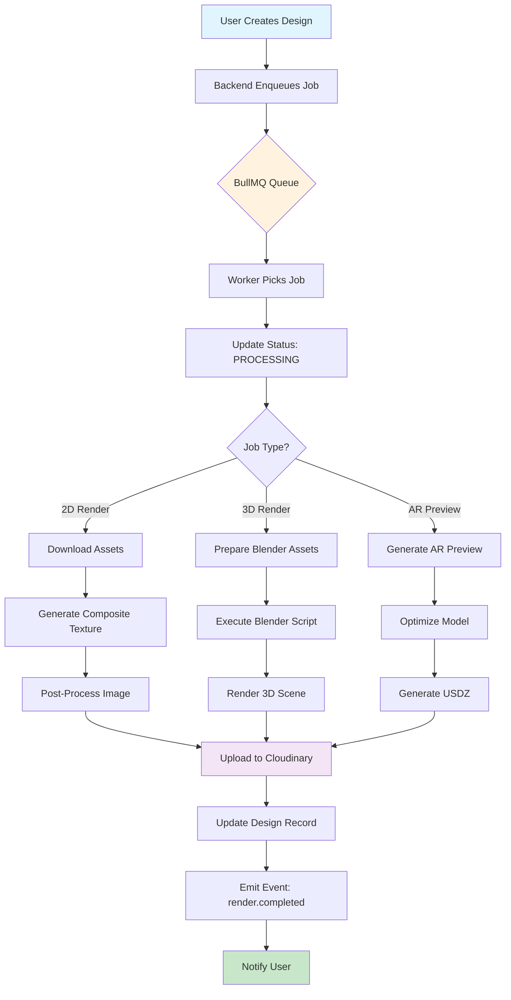
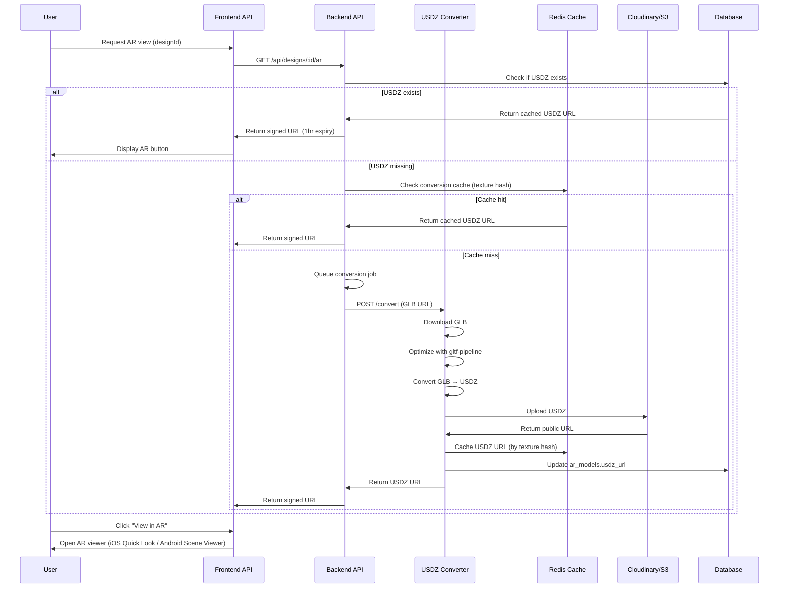
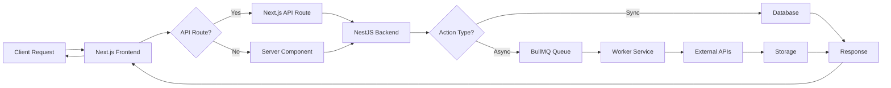
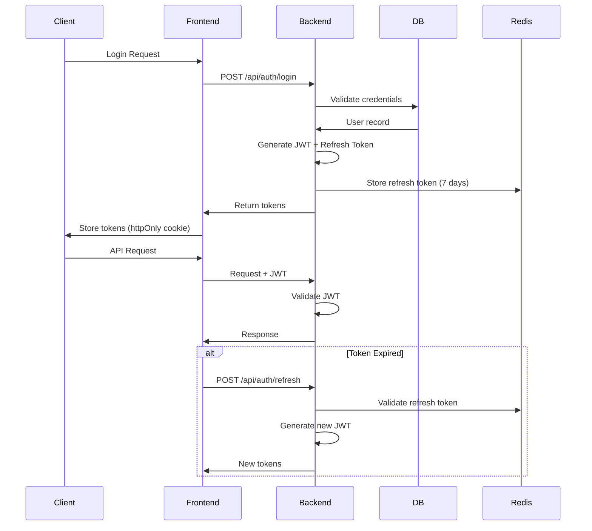
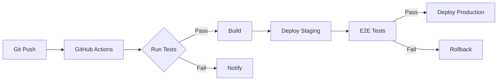

# 🏗️ Luneo Platform Architecture

**Last Updated:** November 16, 2025  
**Version:** 1.0.0

This document provides a comprehensive overview of the Luneo Platform architecture, including key flows and system interactions.

---

## 📋 Table of Contents

1. [System Overview](#system-overview)
2. [Shopify Install Flow](#shopify-install-flow)
3. [Widget Handshake Flow](#widget-handshake-flow)
4. [Worker Render Pipeline](#worker-render-pipeline)
5. [AR Conversion Flow](#ar-conversion-flow)
6. [Component Architecture](#component-architecture)
7. [Data Flow](#data-flow)

---

## System Overview

Luneo Platform is a monorepo-based SaaS platform for 3D/AR product customization. The system consists of:

- **Frontend** (Next.js 15) - User-facing web application
- **Backend** (NestJS) - REST API and business logic
- **Worker** (Node.js + BullMQ) - Background job processing
- **Widget** (React SDK) - Embeddable customization widget
- **Shopify App** (NestJS) - Shopify integration
- **AR Viewer** (React) - WebAR visualization component
- **Mobile** (React Native) - Mobile application

---

## Shopify Install Flow

The Shopify OAuth installation flow enables brands to connect their Shopify stores to Luneo Platform.



### Key Components

- **OAuth Controller** (`apps/backend/src/modules/ecommerce/shopify/shopify.controller.ts`)
- **Shopify Service** (`apps/backend/src/modules/ecommerce/shopify/shopify.service.ts`)
- **Nonce Storage** (Redis with 10-minute TTL)
- **Token Encryption** (AES-256-GCM with PBKDF2)

### Security Features

- ✅ CSRF protection via nonce validation
- ✅ Encrypted token storage (AES-256-GCM)
- ✅ Scope validation before installation
- ✅ HMAC verification for webhooks
- ✅ Origin validation

---

## Widget Handshake Flow

The widget handshake enables secure embedding of the Luneo customization widget into third-party websites (e.g., Shopify stores).



### Key Components

- **Widget SDK** (`apps/widget/src/index.ts`)
- **Widget Controller** (`apps/backend/src/modules/widget/widget.controller.ts`)
- **Widget Service** (`apps/backend/src/modules/widget/widget.service.ts`)
- **Nonce Management** (Redis with single-use enforcement)

### Security Features

- ✅ Short-lived tokens (5-minute expiry)
- ✅ One-time nonces (prevent replay attacks)
- ✅ Origin validation
- ✅ Sandboxed iframe (restricted permissions)
- ✅ CSP headers configured

---

## Worker Render Pipeline

The worker render pipeline processes 3D rendering jobs asynchronously using BullMQ queues.



### Job Types

1. **2D Render** - Composite texture generation
   - Downloads base texture and mask
   - Generates composite using AI
   - Post-processes and optimizes
   - Uploads to Cloudinary

2. **3D Render** - Blender-based rendering
   - Prepares assets (GLB, textures)
   - Generates Blender Python script
   - Executes Blender render
   - Post-processes output
   - Uploads to Cloudinary

3. **AR Preview** - AR model optimization
   - Optimizes GLB with gltf-pipeline
   - Generates USDZ conversion
   - Creates preview thumbnails
   - Uploads to storage

### Key Components

- **Render Worker** (`apps/worker-ia/src/jobs/render-job.ts`)
- **Queue Configuration** (BullMQ with Redis)
- **Tenant Concurrency Manager** (per-brand limits)
- **Circuit Breaker** (API failure protection)

### Configuration

- **Concurrency**: 5 global, 3 per tenant
- **Rate Limiting**: 100 jobs/minute
- **Retry Policy**: Exponential backoff (3 attempts)
- **Cleanup**: Keep last 100 completed, 50 failed

---

## AR Conversion Flow

The AR conversion flow transforms 3D models (GLB) into AR-ready formats (USDZ) for iOS Quick Look and Android Scene Viewer.



### Conversion Methods

1. **Native macOS** (Production)
   - Uses Apple's `usdz-converter` CLI
   - Requires macOS CI/CD runner
   - Best quality output

2. **Python USD Library** (Alternative)
   - Uses Pixar USD Python bindings
   - Cross-platform compatible
   - Good quality output

3. **External API** (Fallback)
   - Third-party conversion service
   - Fast but may have limitations
   - Used when native unavailable

### Key Components

- **AR API Route** (`apps/frontend/src/app/api/ar/convert-usdz/route.ts`)
- **USDZ Converter** (`tools/usdz-converter/`)
- **AR Viewer Component** (`apps/ar-viewer/src/components/ModelViewer.tsx`)
- **Cache Layer** (Redis by texture hash)

### Platform Support

- ✅ **iOS**: Quick Look (`rel="ar"` attribute)
- ✅ **Android**: Scene Viewer (Google Play Services)
- ✅ **Web**: WebXR (experimental)

---

## Component Architecture

### Monorepo Structure

```
luneo-platform/
├── apps/
│   ├── frontend/          # Next.js 15 web app
│   ├── backend/           # NestJS API server
│   ├── worker-ia/         # BullMQ worker service
│   ├── widget/            # Embeddable SDK
│   ├── shopify/           # Shopify app
│   ├── ar-viewer/         # AR viewer component
│   └── mobile/            # React Native app
├── packages/
│   ├── types/             # Shared TypeScript types
│   ├── sdk/               # JavaScript SDK
│   ├── ui/                # Shared UI components
│   └── ...                # Other shared packages
└── tools/
    └── usdz-converter/    # AR conversion tool
```

### Technology Stack

**Frontend:**
- Next.js 15 (App Router)
- React 18
- TypeScript 5
- Tailwind CSS
- Zustand (state)
- TanStack Query (data)

**Backend:**
- NestJS 10
- Prisma 5 (PostgreSQL)
- BullMQ (Redis)
- JWT (Passport)
- Stripe SDK

**Worker:**
- Node.js 20
- BullMQ
- Sharp (image processing)
- OpenAI SDK
- Blender (3D rendering)

**Infrastructure:**
- PostgreSQL (Supabase)
- Redis (Upstash)
- Cloudinary (media storage)
- Vercel (frontend hosting)
- Railway (backend hosting)

---

## Data Flow

### Request Flow



### Authentication Flow



---

## Security Architecture

### Defense in Depth

1. **Network Layer**
   - HTTPS/TLS encryption
   - DDoS protection (Cloudflare)
   - Rate limiting (per IP, per user)

2. **Application Layer**
   - Input validation (Zod schemas)
   - SQL injection prevention (Prisma ORM)
   - XSS protection (React escaping)
   - CSRF tokens (nonce validation)

3. **Authentication**
   - JWT with short expiry (15 min)
   - Refresh tokens (7 days, Redis)
   - OAuth 2.0 (Google, GitHub)
   - MFA support (future)

4. **Data Protection**
   - Encryption at rest (database)
   - Encryption in transit (TLS)
   - Token encryption (AES-256-GCM)
   - PII anonymization

---

## Monitoring & Observability

### Metrics

- **Application Metrics**: Response times, error rates, queue depths
- **Business Metrics**: Designs created, renders completed, AR views
- **Infrastructure Metrics**: CPU, memory, disk, network

### Logging

- **Structured Logging**: JSON format with correlation IDs
- **Log Levels**: Error, Warn, Info, Debug
- **Log Aggregation**: Sentry (errors), CloudWatch (infrastructure)

### Alerting

- **Critical**: Service downtime, payment failures
- **Warning**: High error rates, queue backlog
- **Info**: Deployment notifications, feature flags

---

## Scalability Considerations

### Horizontal Scaling

- **Stateless Services**: Frontend and backend can scale horizontally
- **Queue Workers**: Multiple worker instances process jobs in parallel
- **Database**: Read replicas for query distribution

### Vertical Scaling

- **Worker Nodes**: GPU-enabled for 3D rendering
- **Database**: Larger instances for complex queries
- **Cache**: Redis cluster for high-throughput

### Optimization Strategies

- **Caching**: Redis for frequently accessed data
- **CDN**: Cloudinary for media assets
- **Database Indexing**: Optimized queries
- **Code Splitting**: Lazy loading in frontend
- **Image Optimization**: WebP format, responsive sizes

---

## Deployment Architecture

### Environments

1. **Development**: Local development with Docker Compose
2. **Staging**: Preview deployments (Vercel preview)
3. **Production**: Main production environment

### CI/CD Pipeline



### Deployment Targets

- **Frontend**: Vercel (automatic deployments)
- **Backend**: Railway (containerized)
- **Worker**: Railway (scalable workers)
- **Database**: Supabase (managed PostgreSQL)
- **Cache**: Upstash (managed Redis)

---

## Future Enhancements

### Planned Features

- [ ] Multi-region deployment
- [ ] GraphQL API
- [ ] Real-time collaboration
- [ ] Advanced analytics dashboard
- [ ] Mobile app enhancements
- [ ] Webhook management UI

### Technical Debt

- [ ] Migrate to Turborepo for better monorepo management
- [ ] Implement comprehensive E2E test suite
- [ ] Add performance monitoring (APM)
- [ ] Enhance error tracking and alerting

---

**Documentation Maintained By:** Luneo Platform Team  
**Last Review:** November 16, 2025  
**Next Review:** December 16, 2025
