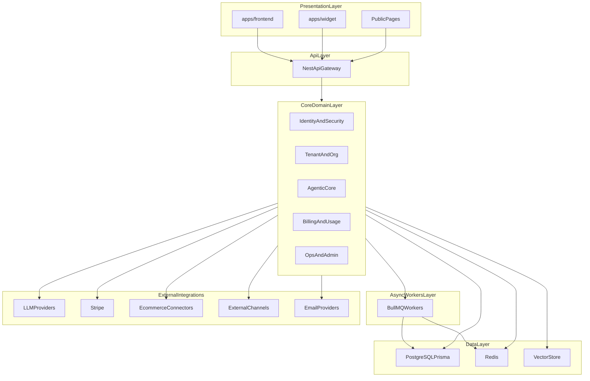

# LUNEO - Architecture Bible 2026

## 0. Portee de ce document

Ce document est la reference officielle pour:
- la conception des nouvelles fonctionnalites,
- la priorisation technique trimestrielle,
- les revues d'architecture et arbitrages produit/tech,
- l'alignement entre equipes frontend, backend, data et ops.

Il complete les livrables suivants:
- `ARCHITECTURE_GAP_ANALYSIS_2026.md`
- `ARCHITECTURE_EXECUTION_ROADMAP_2026.md`
- `ARCHITECTURE_BACKLOG_2026.md`

---

## 1. Intent strategique

Luneo vise une plateforme d'agents IA verticalises. Le produit n'est pas "un chatbot", mais une infrastructure de conversation metier reutilisable entre verticales.

Objectifs structurants:
- Verticale-agnostique au niveau moteur.
- Verticale-specific au niveau templates et workflows.
- Time-to-value client en moins de 1 heure.
- Amelioration continue via learning signals.
- ROI prouve en continu dans le dashboard client.

---

## 2. Principes d'architecture

1. **Monolithe modulaire + workers** avant microservices.
2. **API-first** avec contrats versionnes (`/api/v1`).
3. **Multi-tenant strict** par `organizationId`.
4. **Asynchrone by default** pour traitements longs.
5. **Security by design** (cookies httpOnly, CSRF, CORS strict, RBAC).
6. **Observability by default** (logs structures, metrics, tracing, SLO).
7. **Flywheel data**: chaque interaction devient un signal utile.

---

## 3. Vue macro

---

## 4. Stack officielle (validated)

### Frontend
- Next.js 15 (App Router), React 18, TypeScript
- Tailwind + Radix/shadcn
- TanStack Query + Zustand
- Middleware de securite et controle d'acces

### Backend
- NestJS 10, Prisma 5.22, PostgreSQL
- Redis (cache, locks, throttling), BullMQ
- Swagger/OpenAPI

### Integrations et observabilite
- LLM: OpenAI + providers secondaires
- Stripe, Cloudinary, SendGrid/Mailgun/SMTP
- Sentry, Prometheus, tracing

### Delivery
- Monorepo pnpm + Turbo
- CI/CD GitHub Actions
- Deploy frontend/backend decouple

---

## 5. Architecture frontend cible

### 5.1 Organisation
- `app/`: routes publiques, auth, onboarding, dashboard, admin.
- `components/`: UI primitives + composants metier.
- `features/`: vertical slices (auth, agents, conversations, analytics...).
- `lib/`: api client, auth session, csrf, logger, hooks transverses.

### 5.2 Contraintes
- Toute requete transite via client unifie.
- Gestion session par cookies httpOnly + mecanisme refresh.
- Double-submit CSRF sur routes mutatives.
- Isolation des etats serveur (query cache) et client (zustand).
- Protection des routes sensibles au niveau middleware et layouts.

### 5.3 Regles evolutives
- Une feature = dossier autonome (hooks, queries, schemas, ui).
- Pas d'acces direct aux modules d'une autre feature hors API publique.
- Toute nouvelle feature expose un contrat TypeScript partage.

---

## 6. Architecture backend cible

### 6.1 Bounded contexts
- **Identity/Security**: `auth`, `users`, `security`, `rbac`, `audit`.
- **Tenant**: `organizations`, `settings`, `feature-flags`.
- **Agentic core**: `agents`, `agent-templates`, `orchestrator`, `conversations`, `channels`, `knowledge`, `rag`, `llm`.
- **Revenue**: `billing`, `pricing`, `credits`, `usage-billing`.
- **Ops**: `onboarding`, `notifications`, `admin`, `health`, `contact`.

### 6.2 Nouvelles capacites structurantes (target)
- `verticals`: templates sectoriels et config par verticale.
- `memory`: working/episodic/semantic memory.
- `learning`: signals, gaps, agregation verticale.
- `contacts`: profil progressif et segmentation.
- `actions`: registre d'actions executables.
- `automation`: trigger engine et sequences.

### 6.3 Standards de module
Chaque module livre:
- controller HTTP,
- DTOs + validation stricte,
- services metier,
- acces donnees explicite,
- tests unitaires/integration,
- observabilite minimale (logs + metrics).

---

## 7. Orchestrateur agentique (coeur differenciant)

L'orchestrateur devient la chaine standard d'execution pour tout message entrant.

```mermaid
flowchart LR
  inbound[IncomingMessage] --> normalize[ChannelAdapterNormalize]
  normalize --> identify[ContactAndConversationResolve]
  identify --> intent[IntentClassifier]
  intent --> context[ContextBuilder]
  context --> rag[RagRetrieval]
  rag --> prompt[PromptEngine]
  prompt --> router[LlmRouter]
  router --> action[ActionExecutor]
  action --> safety[AiSafetyChecks]
  safety --> escalate[EscalationDecision]
  escalate --> reply[OutgoingMessage]
  reply --> delivery[ChannelDelivery]
  delivery --> postproc[AsyncPostProcessing]
  postproc --> learning[LearningSignals]
  postproc --> analytics[RoiAndUsageTracking]
```

Responsabilites obligatoires:
- routing d'intention,
- assemblage de contexte tenant + contact + knowledge,
- choix du modele,
- execution d'actions,
- escalade humain,
- emission des signaux de learning et metriques ROI.

---

## 8. Data architecture cible

### 8.1 Noyau actuel confirme
- Authentification: `User`, `Session`, `OAuthAccount`, `RefreshToken`.
- Multi-tenant: `Organization`, `OrganizationMember`, `Invitation`.
- Agentic: `Agent`, `Conversation`, `Message`, `KnowledgeBase`, `KnowledgeChunk`.
- Governance/revenue: `ApiKey`, `Webhook`, `WebhookLog`, `UsageRecord`, `Invoice`, `AuditLog`.

### 8.2 Extensions indispensables
- `VerticalTemplate`
- `Contact` (profil progressif)
- `LearningSignal`, `KnowledgeGap`, `VerticalInsight`
- `Workflow`, `WorkflowExecution`
- Capacites memoire (tables ou structures dediees)

### 8.3 Regles data
- index obligatoires sur `(organizationId, createdAt)` pour entites volumineuses.
- retention policy pour events/conversation artifacts.
- idempotence pour webhooks/jobs.
- migration versionnee avec procedure de rollback testee.

---

## 9. Securite enterprise

### 9.1 Controles obligatoires
- JWT access court + refresh.
- OAuth providers.
- Cookies httpOnly en production.
- RBAC sur operations sensibles.
- CSRF mutatif.
- CORS explicite sans wildcard production.
- Rate limit distribue.
- Validation stricte DTO.

### 9.2 Renforts cibles
- standardisation permissions par ressource,
- rotation des secrets automatisee,
- politique d'audit et forensic,
- runbooks de reponse incident.

---

## 10. Observabilite, fiabilite et SLO

### 10.1 SLO initiaux
- p95 API coeur < 300 ms,
- erreur 5xx < 1%,
- delai de traitement queue critique < 60 s.

### 10.2 Instrumentation obligatoire
- correlation id de bout en bout,
- logs structures JSON,
- metrics techniques + business,
- traces sur flux auth, billing, orchestrator.

### 10.3 Alerting
- incidents utilisateurs d'abord (latence, erreurs, indisponibilite),
- puis saturation interne (queue lag, db contention, token cost spikes).

---

## 11. Workers standard

Workers cibles (BullMQ):
- ai-inference,
- crawling,
- embedding,
- integration-sync,
- notifications,
- learning-analysis,
- vertical-aggregation,
- report-generation,
- billing-usage,
- conversation-summarization.

Regles:
- retry/backoff standardises,
- dead-letter queue pour erreurs terminales,
- idempotence par `IdempotencyKey`.

---

## 12. Verticalisation: strategie de plateforme

### 12.1 Modele
- Le moteur est mutualise.
- La verticale est un template configurable.
- Ajouter une verticale doit etre majoritairement du parametric, pas du code custom.

### 12.2 Contenu template
- questions onboarding,
- intents metier,
- workflows predefinis,
- integrations prioritaires,
- vocabulary/tone,
- KPI de succes,
- objections et reponses de base.

### 12.3 Verticales prioritaires
- V1: ecommerce + immobilier.
- V2: cabinets comptables.
- V3: medical apres pre-requis compliance.

---

## 13. ROI et analytics business

Le dashboard client doit produire une preuve de valeur continue:
- conversations resolues par IA,
- temps humain economise,
- leads qualifies et revenus attribues,
- cout de plateforme et ROI net.

L'analytics devient un levier de retention, pas juste du reporting.

---

## 14. Gouvernance d'implementation

Cadre de pilotage:
- ownership explicite par module,
- ADR pour tout choix structurel,
- quality gates CI (lint/type/tests/build/smoke),
- release train par domaine critique.

Documents de reference d'execution:
- `ARCHITECTURE_GAP_ANALYSIS_2026.md`
- `ARCHITECTURE_EXECUTION_ROADMAP_2026.md`
- `ARCHITECTURE_BACKLOG_2026.md`

---

## 15. Decision structurante

Pour les 12-18 prochains mois:
- **continuer en monolithe modulaire + workers**, extraction microservices seulement sur besoin prouve (charge, equipe, isolation d'un domaine critique).

C'est la strategie optimale pour maximiser vitesse, qualite et optionalite.
