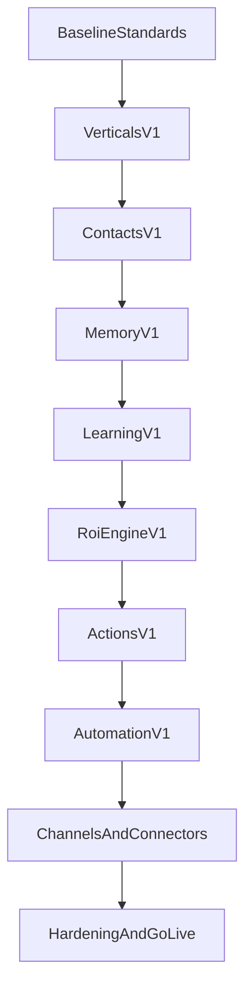

# LUNEO - Execution Roadmap Architecture 2026 (20 semaines)

## 1. Objectif de roadmap

Transformer la cible d'architecture en execution incrementale sans rupture de production, avec priorisation des chantiers a plus fort impact moat + revenu.

---

## 2. Cadence et mode de delivery

- Sprint: 2 semaines
- Horizon: 10 sprints (20 semaines)
- Strategie: monolithe modulaire + workers
- Verticales ciblees: ecommerce et immobilier

Definition of Done globale:
- code + tests unitaires/integration,
- observabilite (logs/metrics) integree,
- documentation API et runbook mis a jour,
- feature flag si impact production.

---

## 3. Contrats minimaux des nouveaux modules (target interfaces)

## 3.1 `verticals`
- `POST /api/v1/verticals/select`
- `GET /api/v1/verticals/templates`
- `GET /api/v1/verticals/:slug`
- Service: resolution template par org, merge overrides.

## 3.2 `contacts`
- `GET /api/v1/contacts`
- `POST /api/v1/contacts`
- `PATCH /api/v1/contacts/:id/profile`
- Service: enrichissement progressif + segmentation.

## 3.3 `memory`
- `GET /api/v1/memory/contacts/:id`
- `POST /api/v1/memory/conversations/:id/summarize`
- Service: working/episodic/semantic memory facade.

## 3.4 `learning`
- `POST /api/v1/learning/signals`
- `GET /api/v1/learning/gaps`
- `POST /api/v1/learning/gaps/:id/approve`
- Jobs: analyse hebdo, aggregation verticale.

## 3.5 `actions`
- `GET /api/v1/actions/catalog`
- `POST /api/v1/actions/execute`
- Service: registre actions + policy de permission.

## 3.6 `automation`
- `POST /api/v1/automation/workflows`
- `POST /api/v1/automation/workflows/:id/toggle`
- Service: trigger/sequence engine + executions journalisees.

---

## 4. Sequencement 20 semaines

## Sprint 1 (S1-S2) - Baseline architecture

Objectifs:
- geler conventions modules/DTO/errors/logging,
- definir contrats API versionnes pour chantiers P0,
- preparer migrations prisma P0.

Dependances:
- aucune.

DoD:
- ADR architecture publie,
- guide conventions backend/frontend publie,
- spec des nouvelles entites validee.

Risques:
- divergence equipe.
Mitigation:
- revue design systematique en debut sprint.

## Sprint 2 (S3-S4) - Module `verticals` V1

Objectifs:
- creer module `verticals`,
- introduire `VerticalTemplate`,
- brancher selection verticale dans onboarding.

Dependances:
- Sprint 1 conventions + schema.

DoD:
- templates ecommerce/immo actifs,
- endpoint selection verticale operationnel,
- tests contractuels onboarding -> vertical config.

Risques:
- scope creep templates.
Mitigation:
- template minimal viable + overrides.

## Sprint 3 (S5-S6) - Module `contacts` V1

Objectifs:
- creer `Contact` model + CRUD essentiel,
- relier conversations au contact unifie,
- enrichissement profil basique (langue/preferences).

Dependances:
- Sprint 2.

DoD:
- toute conversation mappee sur un contact,
- API contacts disponible pour dashboard.

Risques:
- migration donnees historiques.
Mitigation:
- script backfill incremental.

## Sprint 4 (S7-S8) - Module `memory` V1

Objectifs:
- memory facade (working + episodic),
- summarisation conversation resolue en asynchrone,
- exposition contexte contact pour orchestrator.

Dependances:
- Sprint 3.

DoD:
- resume conversation stocke apres resolution,
- recuperation memoire dans orchestrator activee.

Risques:
- latence/qualite des resumes.
Mitigation:
- job queue dedie + fallback simple summary.

## Sprint 5 (S9-S10) - Module `learning` V1

Objectifs:
- collecte `LearningSignal`,
- `KnowledgeGap` detection V1,
- rapport hebdo client minimal.

Dependances:
- Sprints 3-4.

DoD:
- signaux emis sur 100% messages agent,
- endpoint gaps exploitable UI,
- cron hebdo actif.

Risques:
- bruit de signal trop eleve.
Mitigation:
- scoring et dedup par cluster de question.

## Sprint 6 (S11-S12) - ROI engine V1 + analytics unifies

Objectifs:
- normaliser events pour ROI,
- calcul ROI temps reel par org,
- widget ROI dashboard.

Dependances:
- Sprint 5 (learning) + events existants.

DoD:
- formule ROI versionnee,
- endpoint ROI et visualisation frontend.

Risques:
- confiance des chiffres.
Mitigation:
- transparence formule + breakdown affiche.

## Sprint 7 (S13-S14) - `actions` module V1

Objectifs:
- registre d'actions central,
- 5 executors prioritaires (email, ticket, transfer, update_contact, webhook_call),
- guard permissions.

Dependances:
- orchestrator stable + contacts.

DoD:
- actions declenchables via orchestrator,
- journal d'execution action.

Risques:
- effets de bord externes.
Mitigation:
- idempotency + dry-run mode.

## Sprint 8 (S15-S16) - `automation` module V1

Objectifs:
- workflow CRUD + trigger engine,
- sequence engine simple (wait/branch/action),
- executions observables.

Dependances:
- Sprint 7 actions.

DoD:
- 3 workflows templates deployables (ecom/immo),
- execution fiable et rejouable.

Risques:
- explosion de complexite.
Mitigation:
- DSL minimal + limites explicites.

## Sprint 9 (S17-S18) - Channel unification + connectors focus

Objectifs:
- contrat unique adapters canaux,
- hardening webchat/whatsapp/email,
- connecteurs verticaux prioritaires (shopify/calendly).

Dependances:
- Sprints 7-8.

DoD:
- inbound/outbound normalises,
- tests E2E multi-canal critiques.

Risques:
- instabilite provider API.
Mitigation:
- retries, circuit-breaker, fallback queue.

## Sprint 10 (S19-S20) - Hardening, governance, go-live scale

Objectifs:
- quality gates complets,
- SLO dashboard + alerting,
- runbooks incidents,
- readiness review des verticales.

Dependances:
- tous sprints precedents.

DoD:
- checklist go-live complete,
- postmortem process defini,
- ownership modules valide.

Risques:
- dette residuelle.
Mitigation:
- buffer technique planifie + no new feature freeze.

---

## 5. Diagramme d'architecture d'implementation

---

## 6. Quick start 7 jours (lancement P0)

Jour 1-2:
- finaliser schema cibles (`VerticalTemplate`, `Contact`, `LearningSignal`, `KnowledgeGap`).

Jour 3:
- skeleton modules backend (`verticals`, `contacts`, `learning`).

Jour 4-5:
- endpoints minimaux + DTO + tests contractuels.

Jour 6:
- integration orchestrator emission signaux.

Jour 7:
- dashboard minimal gaps + ROI placeholder + revue architecture.

---

## 7. Criteres de succes fin de roadmap

- 2 verticales operationnelles sans fork code.
- time-to-value onboarding < 1h.
- ROI client visible et auditable.
- boucle learning hebdo active avec suggestions actionnables.
- SLO et quality gates en place pour scale.

---

## 8. Operating model (gouvernance + quality gates)

### 8.1 Ownership
- un owner engineering par domaine (`agentic`, `tenant`, `revenue`, `ops`, `security`),
- un backup owner pour continuite delivery,
- revue architecture hebdomadaire (45 min) pour arbitrages.

### 8.2 Quality gates obligatoires
- gate 1: lint/type-check,
- gate 2: tests unitaires + integration,
- gate 3: build + smoke tests,
- gate 4: security checks des routes sensibles.

### 8.3 KPI de pilotage tech
- p95 API globale,
- taux 5xx,
- queue lag max par worker,
- taux echec jobs,
- cout tokens par org et par 100 conversations.

### 8.4 KPI de pilotage produit/business
- taux resolution IA,
- taux escalade humain,
- satisfaction conversation,
- conversion lead qualifie,
- ROI net client,
- adoption des suggestions learning.

### 8.5 Readiness checklist release
- [ ] schema migration testee avec rollback,
- [ ] contrat API documente et versionne,
- [ ] observabilite active (logs/metrics/alerts),
- [ ] tests e2e critiques passants,
- [ ] runbook incident disponible,
- [ ] feature flag active pour rollout progressif.
