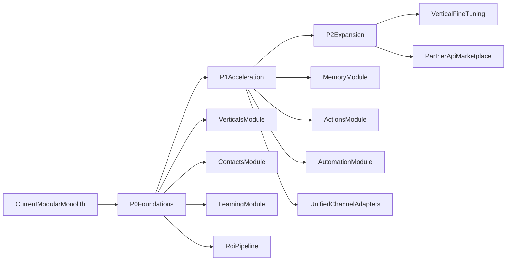

# LUNEO - Gap Analysis Architecture 2026

## 1. Contexte

Ce document compare:
- la cible definie dans `ARCHITECTURE_ENTERPRISE_2026.md`,
- l'etat actuel du code dans `apps/backend` et `apps/frontend`.

Objectif: prioriser les ecarts en P0/P1/P2 avec impact business.

---

## 2. Cartographie factuelle de l'existant

### 2.1 Backend (constate)

Modules presentes (non exhaustif):
- `auth`, `users`, `security`, `rbac`, `organizations`, `settings`, `audit`
- `agents`, `agent-templates`, `orchestrator`, `conversations`, `channels`, `knowledge`, `rag`, `llm`
- `billing`, `pricing`, `credits`, `usage-billing`
- `onboarding`, `notifications`, `admin`, `analytics-clean`, `feature-flags`, `health`, `contact`

Conclusion:
- socle monolithe modulaire solide,
- orchestrator present mais encore incomplet pour la vision "agent platform".

### 2.2 Data model (constate)

Le schema couvre deja:
- identite/tenant (`User`, `Organization`, `OrganizationMember`, etc.),
- agentique (`Agent`, `Conversation`, `Message`, `Knowledge*`),
- governance/revenue (`ApiKey`, `Webhook*`, `UsageRecord`, `Invoice`, `AuditLog`).

Absences critiques constatees:
- pas de `VerticalTemplate`,
- pas de `Contact` unifie enrichi,
- pas de `LearningSignal`/`KnowledgeGap`/`VerticalInsight`,
- pas de `Workflow` et `WorkflowExecution` explicites.

### 2.3 Frontend (constate)

Points forts:
- routes dashboard riches (agents, conversations, knowledge, billing, integrations, onboarding),
- client API unifie robuste (session, CSRF, retry),
- middleware securite evolue (CSP, CORS, rate-limit, protection routes).

Manques:
- pas de vertical feature layer explicite,
- pas de cockpit learning/flywheel industrialise,
- ROI engine pas formalise en produit central.

---

## 3. Ecarts prioritaires

## P0 - Structurants (bloque moat et execution)

1. **Vertical abstraction absente**
- Impact: chaque nouvelle verticale devient partiellement custom.
- Decision: creer module `verticals` + templates versionnes en code.

2. **Customer context model incomplet**
- Impact: perte de personnalisation cross-conversations.
- Decision: introduire `Contact` enrichi + memoire episodique.

3. **Learning flywheel non explicite**
- Impact: pas d'amelioration automatique systemique.
- Decision: module `learning` avec signaux, gaps, agregation verticale.

4. **ROI engine sous-formalise**
- Impact: difficultes a prouver valeur business en continu.
- Decision: standardiser pipeline ROI (events -> calcul -> exposition dashboard).

5. **Orchestrator responsibilities incomplètes**
- Impact: comportement variable selon parcours/canal.
- Decision: imposer pipeline orchestrateur contractuel unique.

## P1 - Accelerateurs (fort levier GTM)

1. **Workflow engine et action registry incomplets**
- Decision: `actions` + `automation` avec contrats d'execution.

2. **Memory layer non standardisee**
- Decision: `memory` (working/episodic/semantic) avec lifecycle clair.

3. **Channel adapters heterogenes**
- Decision: protocole adapter unifie (normalize inbound, format outbound).

4. **Integrations vertical-first non priorisees**
- Decision: concentrer connecteurs E-commerce/Immo avant dispersion.

## P2 - Expansion (apres validation produit)

1. **Fine-tuning vertical**
2. **Canaux avancés (voix)**
3. **Marketplace integrateurs et API ecosystem**
4. **Microservice extraction selective selon charge prouvee**

---

## 4. Matrice "Valeur x Effort"

| Sujet | Valeur business | Effort | Priorite |
|---|---:|---:|---:|
| Vertical templates | Tres elevee | Moyen | P0 |
| Contact + Memory | Tres elevee | Moyen/Eleve | P0 |
| Learning signals + gaps | Tres elevee | Eleve | P0 |
| ROI engine formalise | Elevee | Moyen | P0 |
| Action registry + workflow engine | Elevee | Moyen | P1 |
| Channel normalization contract | Elevee | Moyen | P1 |
| Fine-tuning vertical | Elevee long terme | Eleve | P2 |
| Voice channel | Moyenne | Eleve | P2 |

---

## 5. Architecture cible incrementale (sans big bang)

---

## 6. Risques majeurs et mitigation

1. **Risque dispersion produit**
- Mitigation: 2 verticales max en phase initiale (ecommerce + immobilier).

2. **Risque dette orchestration**
- Mitigation: un pipeline orchestrateur unique + tests de contrats.

3. **Risque inflation cout LLM**
- Mitigation: llm router policy + budget guardrails + fallback models.

4. **Risque explosion complexite data**
- Mitigation: conventions schema, retention, indexing, events contracts.

---

## 7. Sortie attendue

Ce gap analysis alimente directement:
- `ARCHITECTURE_EXECUTION_ROADMAP_2026.md` (sequencement),
- `ARCHITECTURE_BACKLOG_2026.md` (tickets actionnables).
