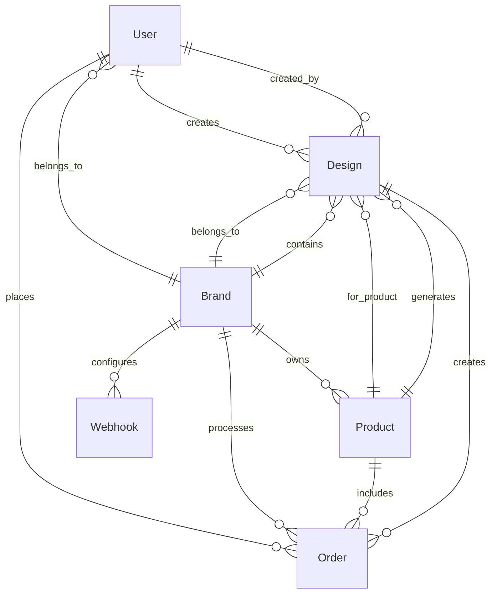

# 🏗️ Architecture Luneo Backend

## Vue d'ensemble

Le backend Luneo est une API REST moderne construite avec NestJS, conçue pour supporter un SaaS multi-tenant de personnalisation produit avec intégration IA.

## 🎯 Objectifs architecturaux

- **Scalabilité**: Support de milliers d'utilisateurs et marques
- **Sécurité**: Protection des données multi-tenant
- **Performance**: Réponse < 200ms pour 95% des requêtes
- **Maintenabilité**: Code modulaire et testable
- **Observabilité**: Monitoring et logging complets

## 🏛️ Architecture en couches

```
┌─────────────────────────────────────┐
│           API Gateway               │
│        (Load Balancer)              │
└─────────────────────────────────────┘
                    │
┌─────────────────────────────────────┐
│         NestJS Application          │
│  ┌─────────────┬─────────────────┐  │
│  │ Controllers │   Middleware    │  │
│  └─────────────┴─────────────────┘  │
│  ┌─────────────┬─────────────────┐  │
│  │  Services   │   Guards        │  │
│  └─────────────┴─────────────────┘  │
│  ┌─────────────┬─────────────────┐  │
│  │   Modules   │  Interceptors   │  │
│  └─────────────┴─────────────────┘  │
└─────────────────────────────────────┘
                    │
┌─────────────────────────────────────┐
│         Data Layer                  │
│  ┌─────────────┬─────────────────┐  │
│  │   Prisma    │     Redis       │  │
│  │   (ORM)     │    (Cache)      │  │
│  └─────────────┴─────────────────┘  │
└─────────────────────────────────────┘
                    │
┌─────────────────────────────────────┐
│         External Services           │
│  ┌─────────────┬─────────────────┐  │
│  │   Stripe    │   Cloudinary    │  │
│  │ (Payments)  │   (Storage)     │  │
│  └─────────────┴─────────────────┘  │
│  ┌─────────────┬─────────────────┐  │
│  │   OpenAI    │   Replicate     │  │
│  │     (AI)    │      (AI)       │  │
│  └─────────────┴─────────────────┘  │
└─────────────────────────────────────┘
```

## 🔧 Composants principaux

### 1. Controllers (API Layer)
- **Responsabilité**: Gestion des requêtes HTTP
- **Technologies**: NestJS Controllers, Swagger
- **Fonctionnalités**: Validation, documentation, routing

### 2. Services (Business Logic)
- **Responsabilité**: Logique métier
- **Technologies**: NestJS Services, Prisma
- **Fonctionnalités**: Règles métier, intégrations externes

### 3. Guards & Interceptors (Security)
- **Responsabilité**: Sécurité et validation
- **Technologies**: JWT, RBAC, Rate Limiting
- **Fonctionnalités**: Authentification, autorisation, limitation

### 4. Data Layer
- **Prisma ORM**: Gestion de la base de données
- **Redis**: Cache et sessions
- **BullMQ**: Queue pour les jobs asynchrones

## 🗄️ Modèle de données

### Entités principales



### Relations multi-tenant

- **Brand**: Entité racine pour l'isolation
- **Scoping**: Toutes les requêtes sont filtrées par `brandId`
- **Permissions**: RBAC basé sur les rôles utilisateur

## 🔐 Sécurité

### Authentification
- **JWT**: Tokens d'accès et de refresh
- **OAuth**: Google, GitHub
- **Session**: Gestion sécurisée des sessions

### Autorisation
- **RBAC**: 5 rôles (CONSUMER, BRAND_USER, BRAND_ADMIN, PLATFORM_ADMIN, FABRICATOR)
- **Scoping**: Isolation automatique par marque
- **Guards**: Protection des endpoints

### Protection des données
- **Rate Limiting**: Limitation par IP et utilisateur
- **Input Validation**: Validation et sanitisation
- **CORS**: Configuration sécurisée
- **Helmet**: Headers de sécurité

## 🚀 Performance

### Optimisations
- **Caching**: Redis pour les données fréquentes
- **Database**: Index optimisés, requêtes optimisées
- **Queue**: Jobs asynchrones pour les tâches lourdes
- **Compression**: Gzip pour les réponses

### Monitoring
- **Health Checks**: Endpoints de santé
- **Metrics**: Prometheus metrics
- **Logging**: Winston avec rotation
- **Tracing**: Sentry pour les erreurs

## 🔄 Flux de données

### Génération IA
```
1. User → POST /designs
2. Controller → DesignService
3. DesignService → AIQueue
4. AIProcessor → OpenAI/Replicate
5. AIProcessor → Cloudinary (upload)
6. AIProcessor → Database (update)
7. Webhook → Brand (notification)
```

### Commande
```
1. User → POST /orders
2. Controller → OrderService
3. OrderService → Stripe (checkout)
4. Stripe → Webhook (payment success)
5. Webhook → OrderService (update status)
6. Webhook → Brand (notification)
```

## 🏢 Multi-tenancy

### Isolation des données
- **Database Level**: Filtrage par `brandId`
- **Application Level**: Guards et interceptors
- **Cache Level**: Préfixage des clés Redis

### Configuration par marque
- **Settings**: JSON flexible dans la table Brand
- **Webhooks**: URLs et secrets par marque
- **Quotas**: Limites par utilisateur et marque

## 🔌 Intégrations externes

### Paiements (Stripe)
- **Checkout Sessions**: Paiement sécurisé
- **Webhooks**: Notifications en temps réel
- **Refunds**: Gestion des remboursements

### Stockage (Cloudinary)
- **Images**: Upload et optimisation
- **Videos**: Support des vidéos
- **Signed URLs**: Accès sécurisé

### IA (OpenAI/Replicate)
- **Image Generation**: DALL-E, Stable Diffusion
- **Cost Tracking**: Suivi des coûts
- **Queue Processing**: Traitement asynchrone

## 📊 Monitoring & Observabilité

### Métriques
- **Application**: Temps de réponse, taux d'erreur
- **Business**: Commandes, designs, revenus
- **Infrastructure**: CPU, mémoire, disque

### Alerting
- **Errors**: Sentry pour les erreurs
- **Performance**: Alertes sur les temps de réponse
- **Business**: Alertes sur les métriques métier

## 🚀 Déploiement

### Environnements
- **Development**: Docker Compose local
- **Staging**: Environnement de test
- **Production**: Infrastructure cloud

### CI/CD
- **GitHub Actions**: Tests automatiques
- **Security**: Audit de sécurité
- **Deployment**: Déploiement automatique

## 🔮 Évolutions futures

### Court terme
- **GraphQL**: Support GraphQL
- **WebSockets**: Communication temps réel
- **Microservices**: Décomposition en services

### Long terme
- **Event Sourcing**: Architecture événementielle
- **CQRS**: Séparation lecture/écriture
- **Kubernetes**: Orchestration conteneurs

## 📚 Ressources

- [NestJS Documentation](https://docs.nestjs.com/)
- [Prisma Documentation](https://www.prisma.io/docs/)
- [Stripe API Reference](https://stripe.com/docs/api)
- [OpenAI API Reference](https://platform.openai.com/docs/)
