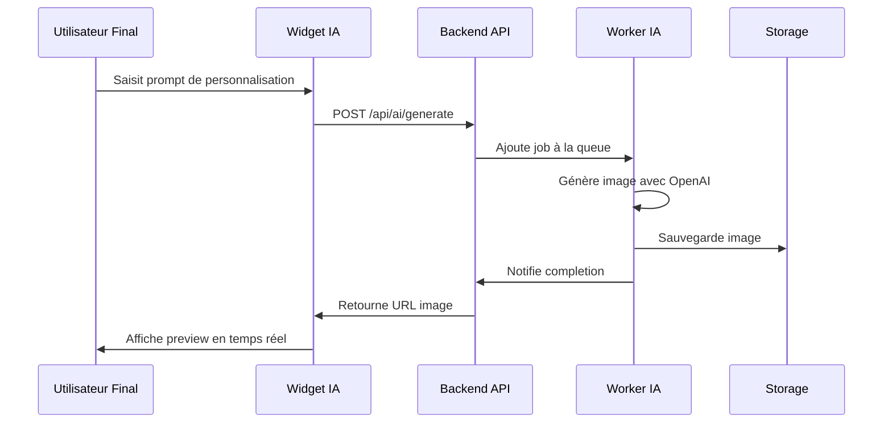
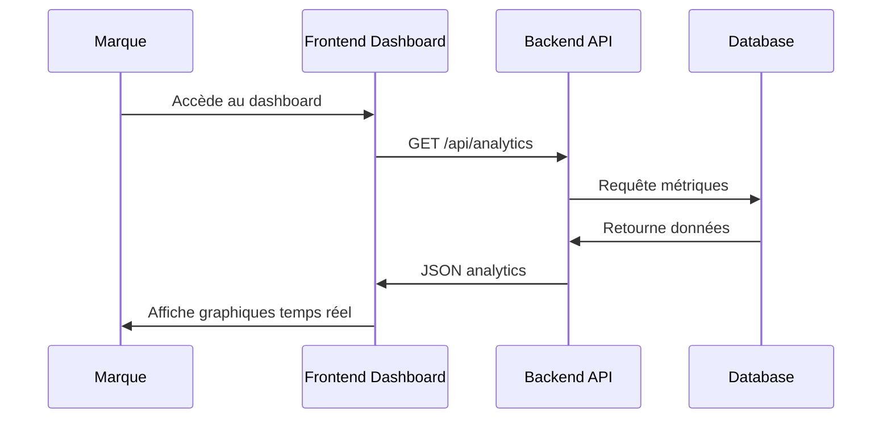

# 🏗️ LUNEO ENTERPRISE SAAS — Architecture Technique Complète

## 📋 Vue d'ensemble

**Luneo** est une plateforme SaaS B2B d'intelligence artificielle permettant aux marques d'offrir à leurs clients la personnalisation visuelle et interactive de leurs produits via prompts et rendu IA + AR.

### 🎯 Objectifs
- **Pour les marques B2B** : Solution SaaS intégrée pour la personnalisation de produits
- **Pour les clients finaux** : Visualisation en temps réel sur le site de la marque (widget + AR)
- **Pour les marques** : Dashboard complet de suivi, gestion et analyse

---

## 🧱 Stack Technologique

| Couche | Technologies |
|--------|--------------|
| **Frontend** | Next.js 15 + TypeScript + Tailwind + shadcn/ui |
| **Backend** | NestJS + Prisma + PostgreSQL + Redis |
| **IA Worker** | Node.js + BullMQ + OpenAI + Sharp |
| **Widget** | React + Vite (SDK JS exportable) |
| **AR Viewer** | WebXR / `<model-viewer>` |
| **Mobile** | React Native + Expo |
| **Infrastructure** | Docker + Terraform + GitHub Actions + AWS/Hetzner |
| **Observabilité** | Prometheus + Grafana + Loki |
| **Monorepo** | Turborepo |

---

## 📁 Structure du Projet

```
luneo/
├── apps/
│   ├── frontend/                    # 🎨 Interface marques (Next.js 15)
│   │   ├── src/app/
│   │   │   ├── (auth)/             # 🔐 Authentification
│   │   │   │   ├── login/
│   │   │   │   ├── register/
│   │   │   │   └── reset-password/
│   │   │   ├── (dashboard)/        # 🏢 Dashboard Enterprise
│   │   │   │   ├── dashboard/
│   │   │   │   ├── ai-studio/
│   │   │   │   ├── analytics/
│   │   │   │   ├── products/
│   │   │   │   ├── billing/
│   │   │   │   ├── team/
│   │   │   │   ├── integrations/
│   │   │   │   └── settings/
│   │   │   ├── help/
│   │   │   ├── pricing/
│   │   │   ├── about/
│   │   │   ├── contact/
│   │   │   └── subscribe/
│   │   ├── components/             # 🧩 Composants UI globaux
│   │   ├── hooks/                  # 🪝 Custom hooks React
│   │   ├── lib/                    # 🔧 Utilitaires
│   │   ├── store/                  # 🗂️ Zustand store
│   │   ├── styles/                 # 🎨 Tailwind / Tokens
│   │   └── types/
│   │
│   ├── backend/                    # ⚡ API principale (NestJS)
│   │   ├── src/
│   │   │   ├── modules/
│   │   │   │   ├── auth/           # 🔐 Authentification JWT/SSO
│   │   │   │   ├── users/          # 👥 Gestion utilisateurs
│   │   │   │   ├── brands/         # 🏢 Gestion marques
│   │   │   │   ├── products/       # 📦 Catalogue produits
│   │   │   │   ├── designs/        # 🎨 Gestion designs
│   │   │   │   ├── orders/         # 📋 Commandes
│   │   │   │   ├── ai/             # 🤖 API IA
│   │   │   │   ├── admin/          # ⚙️ Administration
│   │   │   │   ├── webhooks/       # 🔗 Webhooks
│   │   │   │   ├── email/          # 📧 Service email
│   │   │   │   ├── health/         # 🏥 Health checks
│   │   │   │   └── integrations/   # 🔌 Intégrations tierces
│   │   │   ├── prisma/
│   │   │   ├── jobs/
│   │   │   ├── scripts/
│   │   │   └── utils/
│   │
│   ├── widget/                     # 🧩 Widget IA de personnalisation (JS SDK)
│   │   ├── src/
│   │   │   ├── components/
│   │   │   │   ├── PromptInput.tsx
│   │   │   │   ├── PreviewCanvas.tsx
│   │   │   │   ├── LoadingSpinner.tsx
│   │   │   │   └── ErrorBoundary.tsx
│   │   │   ├── api/
│   │   │   ├── hooks/
│   │   │   ├── styles/
│   │   │   ├── lib/
│   │   │   └── types/
│   │
│   ├── worker-ia/                  # 🤖 Service IA (pipeline image/3D)
│   │   ├── src/
│   │   │   ├── jobs/
│   │   │   │   ├── generateImage.ts
│   │   │   │   ├── upscale.ts
│   │   │   │   ├── blendTexture.ts
│   │   │   │   ├── exportGLTF.ts
│   │   │   │   └── arPreview.ts
│   │   │   ├── utils/
│   │   │   │   ├── openai.ts
│   │   │   │   ├── sharp.ts
│   │   │   │   ├── blender.ts
│   │   │   │   └── moderation.ts
│   │   │   ├── config/
│   │   │   ├── queue/
│   │   │   └── prisma/
│   │
│   ├── ar-viewer/                  # 📱 Module WebAR (WebXR)
│   │   ├── src/
│   │   │   ├── components/
│   │   │   │   ├── ModelViewer.tsx
│   │   │   │   ├── ARButton.tsx
│   │   │   │   └── FallbackImage.tsx
│   │   │   ├── hooks/
│   │   │   ├── lib/
│   │   │   └── types/
│   │
│   └── mobile/                     # 📱 App mobile (Phase 2)
│       ├── src/
│       │   ├── screens/
│       │   ├── components/
│       │   ├── services/
│       │   ├── store/
│       │   └── utils/
│
├── packages/
│   ├── ui/                         # 🧱 Design system partagé (shadcn/ui)
│   ├── eslint-config-custom/
│   ├── tsconfig/
│   ├── types/
│   ├── logger/                     # 🪶 Logger structuré (Winston / Pino)
│   └── config/                     # ⚙️ Config partagée (env, constants)
│
├── infra/                          # ☁️ Infrastructure et DevOps
│   ├── terraform/
│   ├── docker/
│   ├── ansible/
│   ├── ci-cd/
│   └── scripts/
│
├── docs/                           # 📚 Documentation technique & API
│   ├── api-reference/
│   ├── runbooks/
│   ├── security/
│   └── README.md
│
├── monitoring/                     # 📈 Observabilité / logs / métriques
│   ├── prometheus/
│   ├── grafana/
│   ├── loki/
│   └── alertmanager/
│
└── scripts/
    ├── setup.sh
    ├── lint-all.sh
    ├── test-all.sh
    └── local-dev.sh
```

---

## 🔄 Flux Fonctionnel

### 1. **Flux Principal de Personnalisation**


### 2. **Flux Dashboard Marque**


---

## 🧠 Modules IA

### **Worker IA Principal**
- **`generateImage.ts`** : Génération d'images avec DALL-E 3
- **`upscale.ts`** : Amélioration de résolution
- **`blendTexture.ts`** : Superposition de textures/gravures
- **`exportGLTF.ts`** : Conversion en modèle 3D
- **`arPreview.ts`** : Génération version AR-ready

### **Pipeline de Traitement**
1. **Réception prompt** → Validation et enrichissement
2. **Génération IA** → DALL-E 3 avec styles prédéfinis
3. **Post-traitement** → Sharp pour optimisations
4. **Export multi-format** → PNG, JPG, PDF, SVG, 3D
5. **Prévisualisation AR** → USDZ/GLTF pour WebXR

---

## 📊 Données & Stockage

| Élément | Technologie | Description |
|---------|-------------|-------------|
| **Base de données** | PostgreSQL | Multi-tenant, Prisma ORM |
| **Cache / Queue** | Redis | BullMQ pour traitement IA |
| **Fichiers médias** | S3 / Cloudflare R2 | Images & modèles 3D |
| **Logs / Metrics** | Grafana + Loki | Monitoring IA et backend |

---

## 🔐 Sécurité

### **Authentification & Autorisation**
- JWT tokens avec refresh automatique
- SSO SAML/OAuth2 pour entreprises
- RBAC (Role-Based Access Control)
- Rate limiting par utilisateur/IP

### **Protection des Données**
- Chiffrement AES-256 en transit et au repos
- Anonymisation des prompts sensibles
- Conformité RGPD complète
- Audit logs pour toutes les actions

### **Sécurité API**
- Validation stricte des inputs
- Sanitisation des prompts IA
- Webhook signatures vérifiées
- CORS configuré par domaine

---

## 🚀 Déploiement & Infrastructure

### **Environnements**
- **dev** : Docker local + hot reload
- **staging** : Tests QA + sandbox API
- **prod** : Infra scalable (AWS ECS / Hetzner)

### **CI/CD Pipeline**
```yaml
Build → Test → Lint → Security Scan → Deploy → Health Check
```

### **Monitoring**
- **Métriques** : Prometheus + Grafana
- **Logs** : Loki + Elasticsearch
- **Alertes** : AlertManager + Slack/PagerDuty
- **Tracing** : Jaeger pour debugging distribué

---

## 🗺️ Roadmap

### **Phase 1 (Actuelle)**
- ✅ SaaS B2B (Dashboard marques)
- ✅ Widget IA (texte → image)
- ✅ Génération visuelle & preview temps réel
- ✅ API complète avec authentification

### **Phase 2 (Q2 2025)**
- 🔄 Export AR (WebXR + ModelViewer)
- 🔄 Application mobile React Native
- 🔄 Marketplace d'assets IA (textures, gravures)

### **Phase 3 (Q3 2025)**
- 📋 IA fine-tunée par marque
- 📋 Recommandations dynamiques
- 📋 API publique (monétisable)

---

## 🧑‍💻 Contribution & Maintenance

### **Standards de Code**
- TypeScript strict mode
- ESLint + Prettier
- Tests unitaires (Jest) + E2E (Playwright)
- Commits conventionnels

### **Documentation**
- API OpenAPI/Swagger
- Guides de déploiement
- Runbooks d'incidents
- Architecture décision records (ADRs)

### **Processus**
- PR Review obligatoire
- Tests automatisés avant merge
- Déploiement automatique sur staging
- Validation manuelle avant production

---

> ✅ **Cette architecture sert de référence unique** pour toute l'équipe technique.  
> Elle peut être lue directement par **Cursor**, GitHub Copilot ou tout IDE pour structurer les modules automatiquement.