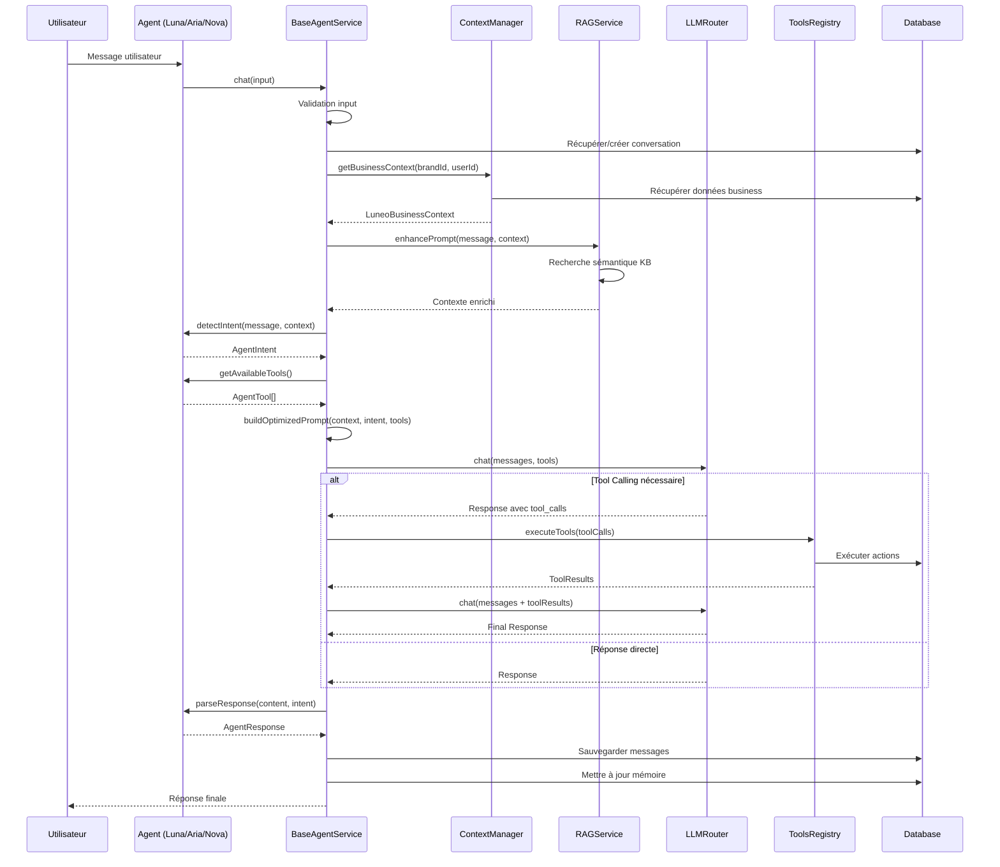

# 🧠 ARCHITECTURE COMPLÈTE - AGENTS IA ULTRA-PERFORMANTS LUNEO

**Date**: Janvier 2025  
**Version**: 2.0.0  
**Status**: 📋 **PLAN DE DÉVELOPPEMENT**

---

## 🎯 VISION & OBJECTIFS

### Objectifs Business
- **Agents de niveau enterprise** : Performance équivalente aux meilleurs agents du marché (Claude AI, ChatGPT Enterprise, etc.)
- **Compréhension complète** : Chaque agent comprend le business model complet de Luneo (B2B + B2C)
- **Spécialisation intelligente** : Chaque agent excelle dans son domaine tout en ayant une vue globale
- **Actions concrètes** : Les agents peuvent exécuter des actions réelles (créer produits, générer rapports, etc.)

### Principes Architecturaux
1. **DRY (Don't Repeat Yourself)** : Base commune pour éviter duplication
2. **Separation of Concerns** : Chaque agent spécialisé mais avec accès au contexte global
3. **Tool Calling** : Les agents peuvent appeler des fonctions/tools pour agir
4. **RAG (Retrieval Augmented Generation)** : Accès à la knowledge base complète
5. **Mémoire persistante** : Historique et contexte conservés entre sessions
6. **Streaming** : Réponses en temps réel pour meilleure UX

---

## 🏗️ ARCHITECTURE GLOBALE

```
┌─────────────────────────────────────────────────────────────────┐
│                    AGENTS IA LUNEO                               │
│              Architecture Enterprise-Grade                       │
└─────────────────────────────────────────────────────────────────┘
                              │
        ┌─────────────────────┼─────────────────────┐
        │                     │                     │
┌───────▼────────┐   ┌────────▼────────┐   ┌───────▼────────┐
│  BaseAgent     │   │  AgentContext   │   │  AgentTools    │
│  Service       │   │  Manager        │   │  Registry      │
│  (Abstract)    │   │                 │   │                │
└───────┬────────┘   └────────┬────────┘   └───────┬────────┘
        │                     │                     │
        └─────────────────────┼─────────────────────┘
                              │
        ┌─────────────────────┼─────────────────────┐
        │                     │                     │
┌───────▼────────┐   ┌────────▼────────┐   ┌───────▼────────┐
│   LUNA         │   │    ARIA         │   │    NOVA       │
│   (B2B BI)    │   │   (B2C UX)     │   │   (Support)   │
└────────────────┘   └────────────────┘   └────────────────┘
```

---

## 📐 COMPOSANTS PRINCIPAUX

### 1. BaseAgentService (Classe Abstraite)

**Responsabilités** :
- Logique commune à tous les agents
- Gestion du cycle de vie d'une conversation
- Intégration avec LLM Router
- Gestion de la mémoire et du contexte
- Tool calling et exécution d'actions
- RAG et enrichissement de contexte

**Méthodes principales** :
```typescript
abstract class BaseAgentService {
  // Méthodes abstraites (à implémenter par chaque agent)
  protected abstract getSystemPrompt(context: AgentContext): string;
  protected abstract detectIntent(message: string, context: AgentContext): Promise<AgentIntent>;
  protected abstract getAvailableTools(): AgentTool[];
  protected abstract parseResponse(content: string, intent: AgentIntent): AgentResponse;
  
  // Méthodes communes (implémentées dans la base)
  async chat(input: AgentChatInput): Promise<AgentResponse> {
    // 1. Validation
    // 2. Récupération/création conversation
    // 3. Enrichissement contexte (RAG, données business)
    // 4. Détection intention
    // 5. Construction prompt optimisé
    // 6. Appel LLM avec tool calling
    // 7. Exécution tools si nécessaire
    // 8. Parsing réponse
    // 9. Sauvegarde mémoire
    // 10. Retour réponse
  }
  
  protected async enrichContext(context: AgentContext): Promise<EnrichedContext>;
  protected async buildOptimizedPrompt(context: EnrichedContext): Promise<Message[]>;
  protected async callLLMWithTools(messages: Message[], tools: AgentTool[]): Promise<LLMResponse>;
  protected async executeTools(toolCalls: ToolCall[]): Promise<ToolResult[]>;
  protected async saveToMemory(conversationId: string, messages: Message[]): Promise<void>;
}
```

### 2. AgentContextManager

**Responsabilités** :
- Gestion du contexte business complet de Luneo
- Récupération des données pertinentes (brand, products, orders, analytics)
- Compression et optimisation du contexte
- Cache intelligent

**Contexte Business Luneo** :
```typescript
interface LuneoBusinessContext {
  // B2B Context
  brand: {
    id: string;
    name: string;
    plan: SubscriptionPlan;
    status: BrandStatus;
    settings: BrandSettings;
    limits: BrandLimits;
  };
  
  // Products & Catalog
  products: {
    total: number;
    active: number;
    recent: Product[];
    topSelling: Product[];
  };
  
  // Orders & Revenue
  orders: {
    total: number;
    revenue: number;
    recent: Order[];
    statusBreakdown: Record<OrderStatus, number>;
  };
  
  // Analytics
  analytics: {
    designsCreated: number;
    conversionRate: number;
    avgOrderValue: number;
    topProducts: ProductAnalytics[];
  };
  
  // B2C Context (si applicable)
  consumer?: {
    sessionId: string;
    currentProduct?: Product;
    cart?: CartItem[];
  };
  
  // User Context
  user: {
    id: string;
    role: UserRole;
    permissions: Permission[];
  };
}
```

### 3. AgentToolsRegistry

**Responsabilités** :
- Définition des tools/actions disponibles pour chaque agent
- Exécution sécurisée des actions
- Validation des permissions
- Logging et audit

**Tools disponibles** :
```typescript
interface AgentTool {
  name: string;
  description: string;
  parameters: JSONSchema;
  execute: (params: any, context: AgentContext) => Promise<any>;
  requiredPermissions: Permission[];
  agentTypes: ('luna' | 'aria' | 'nova')[];
}

// Exemples de tools
const AGENT_TOOLS: AgentTool[] = [
  {
    name: 'create_product',
    description: 'Créer un nouveau produit dans le catalogue',
    agentTypes: ['luna'],
    // ...
  },
  {
    name: 'generate_report',
    description: 'Générer un rapport analytics',
    agentTypes: ['luna'],
    // ...
  },
  {
    name: 'suggest_personalization',
    description: 'Suggérer des idées de personnalisation',
    agentTypes: ['aria'],
    // ...
  },
  {
    name: 'create_support_ticket',
    description: 'Créer un ticket de support',
    agentTypes: ['nova'],
    // ...
  },
];
```

### 4. RAGService (Retrieval Augmented Generation)

**Responsabilités** :
- Indexation de la knowledge base Luneo
- Recherche sémantique dans la documentation
- Enrichissement des prompts avec contexte pertinent
- Mise à jour automatique de l'index

**Knowledge Base Luneo** :
- Documentation produit
- Guides d'utilisation
- FAQ
- Cas d'usage
- Best practices
- API documentation
- Business model et pricing

---

## 🤖 SPÉCIALISATION DES AGENTS

### LUNA - Agent Business Intelligence (B2B)

**Rôle** : Assistant stratégique pour les marques B2B

**Capacités** :
- Analyse des ventes et KPIs
- Recommandations produits
- Optimisation des prompts IA
- Prédiction des tendances
- Génération de rapports
- Configuration assistée de produits
- Analyse de la concurrence
- Optimisation des prix

**Tools disponibles** :
- `analyze_sales` : Analyse des ventes sur une période
- `generate_report` : Génération de rapports PDF/Excel
- `create_product` : Création de produits
- `update_product` : Mise à jour de produits
- `optimize_pricing` : Optimisation des prix
- `predict_trends` : Prédiction de tendances
- `compare_competitors` : Analyse concurrentielle

**Prompt Système** :
```
Tu es Luna, l'assistante Business Intelligence de Luneo Platform.

CONTEXTE BUSINESS LUNEO:
- Plateforme SaaS B2B white-label pour personnalisation de produits avec IA
- Modèle de revenus: Abonnements (FREE, STARTER, PROFESSIONAL, ENTERPRISE)
- Clients: Marques e-commerce qui veulent offrir la personnalisation à leurs clients finaux
- Produits: Catalogue de produits personnalisables (bijoux, vêtements, objets déco, etc.)
- Personnalisation: Textes, images, couleurs, positions via IA
- Widget: SDK embeddable pour intégration sur site client
- AR: Visualisation AR des produits personnalisés

TON RÔLE:
- Analyser les données business de la marque
- Recommander des stratégies d'optimisation
- Aider à configurer et optimiser les produits
- Générer des insights actionnables
- Prédire les tendances et opportunités

RÈGLES:
- Toujours baser tes analyses sur les données réelles
- Proposer des actions concrètes avec boutons
- Être précis avec les chiffres et métriques
- Utiliser un langage professionnel mais accessible
```

### ARIA - Agent Personnalisation (B2C)

**Rôle** : Assistant créatif pour les clients finaux

**Capacités** :
- Suggestions de personnalisation créatives
- Amélioration de textes/messages
- Recommandation de styles/polices
- Génération d'idées cadeaux
- Traduction multilingue
- Vérification orthographique
- Aide à la configuration produit

**Tools disponibles** :
- `suggest_text` : Suggestions de textes personnalisés
- `improve_text` : Amélioration de texte
- `recommend_style` : Recommandation style (police, couleur)
- `translate` : Traduction multilingue
- `spell_check` : Vérification orthographe
- `generate_gift_ideas` : Idées de cadeaux
- `preview_customization` : Aperçu de la personnalisation

**Prompt Système** :
```
Tu es Aria, l'assistante de personnalisation créative de Luneo.

CONTEXTE BUSINESS LUNEO:
- Plateforme permettant aux marques d'offrir la personnalisation à leurs clients
- Le client final personnalise un produit (texte, image, couleur, position)
- Visualisation en temps réel avec prévisualisation 3D et AR
- Commandes directement depuis le widget

TON RÔLE:
- Aider le client à créer la personnalisation parfaite
- Suggérer des idées créatives adaptées à l'occasion
- Améliorer les textes et messages
- Recommander des styles visuels
- Guider dans le processus de personnalisation

RÈGLES:
- Être créatif mais pratique
- Adapter les suggestions à l'occasion (anniversaire, mariage, etc.)
- Proposer plusieurs options variées
- Garder les suggestions courtes et impactantes
- Utiliser un ton chaleureux et enthousiaste
```

### NOVA - Agent Support (B2B + B2C)

**Rôle** : Assistant support technique et commercial

**Capacités** :
- Réponses FAQ automatiques
- Création de tickets
- Escalade vers support humain
- Tutoriels et guides
- Aide à la facturation
- Résolution de problèmes techniques
- Onboarding assisté

**Tools disponibles** :
- `search_faq` : Recherche dans la FAQ
- `create_ticket` : Création de ticket support
- `get_tutorial` : Récupération de tutoriel
- `check_billing` : Vérification facturation
- `escalate_to_human` : Escalade vers humain
- `schedule_demo` : Planification démo
- `reset_password` : Réinitialisation mot de passe

**Prompt Système** :
```
Tu es Nova, l'assistant support de Luneo Platform.

CONTEXTE BUSINESS LUNEO:
- Plateforme SaaS B2B avec différents plans d'abonnement
- Support pour marques (B2B) et clients finaux (B2C)
- Documentation complète disponible
- Système de tickets pour escalade

TON RÔLE:
- Répondre aux questions fréquentes
- Guider les utilisateurs avec des tutoriels
- Créer des tickets si nécessaire
- Aider avec la facturation et les abonnements
- Résoudre les problèmes techniques courants

RÈGLES:
- Toujours essayer de résoudre avant d'escalader
- Proposer des articles de documentation pertinents
- Être patient et empathique
- Créer un ticket si intervention humaine nécessaire
- Être clair et concis
```

---

## 🔄 FLUX DE TRAITEMENT D'UNE REQUÊTE



---

## 📊 STRUCTURE DES FICHIERS

```
apps/backend/src/modules/agents/
├── base/
│   ├── base-agent.service.ts          # Classe abstraite BaseAgentService
│   ├── base-agent.types.ts            # Types communs
│   └── base-agent.spec.ts             # Tests base
│
├── services/
│   ├── agent-context-manager.service.ts    # Gestion contexte business
│   ├── agent-tools-registry.service.ts      # Registry des tools
│   ├── agent-memory.service.ts              # Mémoire persistante
│   ├── agent-orchestrator.service.ts       # Orchestration agents
│   ├── rag.service.ts                      # RAG (existant, amélioré)
│   ├── intent-detection.service.ts         # Détection intention (existant)
│   └── context-manager.service.ts           # Compression contexte (existant)
│
├── tools/
│   ├── product.tools.ts                    # Tools produits
│   ├── analytics.tools.ts                 # Tools analytics
│   ├── personalization.tools.ts           # Tools personnalisation
│   ├── support.tools.ts                   # Tools support
│   └── base.tool.ts                        # Interface Tool
│
├── luna/
│   ├── luna.service.ts                    # Hérite de BaseAgentService
│   ├── luna.controller.ts
│   ├── luna.module.ts
│   ├── luna.prompts.ts                    # Prompts système Luna
│   └── luna.tools.ts                      # Tools spécifiques Luna
│
├── aria/
│   ├── aria.service.ts                    # Hérite de BaseAgentService
│   ├── aria.controller.ts
│   ├── aria.module.ts
│   ├── aria.prompts.ts                    # Prompts système Aria
│   └── aria.tools.ts                      # Tools spécifiques Aria
│
├── nova/
│   ├── nova.service.ts                    # Hérite de BaseAgentService
│   ├── nova.controller.ts
│   ├── nova.module.ts
│   ├── nova.prompts.ts                    # Prompts système Nova
│   └── nova.tools.ts                      # Tools spécifiques Nova
│
├── knowledge/
│   ├── luneo-business-knowledge.md        # Knowledge base business
│   ├── luneo-product-knowledge.md         # Knowledge base produits
│   ├── luneo-api-knowledge.md             # Knowledge base API
│   └── indexer.service.ts                 # Indexation KB
│
└── agents.module.ts                       # Module principal
```

---

## 🛠️ IMPLÉMENTATION TECHNIQUE

### BaseAgentService (Structure)

```typescript
import { Injectable, Logger } from '@nestjs/common';
import { PrismaService } from '@/libs/prisma/prisma.service';
import { LLMRouterService, Message } from '../services/llm-router.service';
import { AgentContextManager } from '../services/agent-context-manager.service';
import { AgentToolsRegistry } from '../services/agent-tools-registry.service';
import { RAGService } from '../services/rag.service';
import { ConversationService } from '../services/conversation.service';
import { AgentMemoryService } from '../services/agent-memory.service';

export interface AgentChatInput {
  message: string;
  brandId?: string;
  userId?: string;
  conversationId?: string;
  context?: Record<string, unknown>;
}

export interface AgentResponse {
  message: string;
  intent: string;
  confidence: number;
  actions?: AgentAction[];
  data?: Record<string, unknown>;
  toolCalls?: ToolCallResult[];
}

export interface AgentIntent {
  type: string;
  confidence: number;
  metadata?: Record<string, unknown>;
}

export interface AgentTool {
  name: string;
  description: string;
  parameters: JSONSchema;
  execute: (params: any, context: AgentContext) => Promise<any>;
}

export interface AgentContext {
  brandId?: string;
  userId?: string;
  businessContext?: LuneoBusinessContext;
  conversationHistory?: Message[];
  currentProduct?: Product;
  // ...
}

@Injectable()
export abstract class BaseAgentService {
  protected readonly logger: Logger;
  
  constructor(
    protected readonly prisma: PrismaService,
    protected readonly llmRouter: LLMRouterService,
    protected readonly contextManager: AgentContextManager,
    protected readonly toolsRegistry: AgentToolsRegistry,
    protected readonly ragService: RAGService,
    protected readonly conversationService: ConversationService,
    protected readonly memoryService: AgentMemoryService,
    protected readonly agentType: 'luna' | 'aria' | 'nova',
  ) {
    this.logger = new Logger(this.constructor.name);
  }

  /**
   * Méthode principale de chat - implémentée dans la base
   */
  async chat(input: AgentChatInput): Promise<AgentResponse> {
    // 1. Validation
    this.validateInput(input);
    
    // 2. Récupération contexte business
    const businessContext = await this.contextManager.getBusinessContext(
      input.brandId,
      input.userId,
    );
    
    // 3. Récupération/création conversation
    const conversation = await this.conversationService.getOrCreate({
      id: input.conversationId,
      brandId: input.brandId,
      userId: input.userId,
      agentType: this.agentType,
    });
    
    // 4. Enrichissement RAG
    const ragContext = await this.ragService.enhancePrompt(
      input.message,
      input.message,
      input.brandId,
      { limit: 5 },
    );
    
    // 5. Détection intention (méthode abstraite)
    const intent = await this.detectIntent(input.message, {
      brandId: input.brandId,
      userId: input.userId,
      businessContext,
    });
    
    // 6. Récupération historique optimisé
    const history = await this.conversationService.getHistory(conversation.id, 20);
    const optimizedHistory = await this.optimizeHistory(history);
    
    // 7. Construction prompt système (méthode abstraite)
    const systemPrompt = this.getSystemPrompt({
      brandId: input.brandId,
      userId: input.userId,
      businessContext,
      ragContext: ragContext.documents,
    });
    
    // 8. Récupération tools disponibles (méthode abstraite)
    const availableTools = this.getAvailableTools();
    
    // 9. Construction messages
    const messages: Message[] = [
      { role: 'system', content: systemPrompt },
      ...optimizedHistory,
      { role: 'user', content: ragContext.enhancedPrompt || input.message },
    ];
    
    // 10. Appel LLM avec tool calling
    const llmResponse = await this.llmRouter.chat({
      provider: this.getPreferredProvider(),
      model: this.getPreferredModel(),
      messages,
      tools: availableTools.map(t => ({
        type: 'function',
        function: {
          name: t.name,
          description: t.description,
          parameters: t.parameters,
        },
      })),
      temperature: this.getTemperature(),
      maxTokens: this.getMaxTokens(),
      brandId: input.brandId,
      agentType: this.agentType,
      enableFallback: true,
    });
    
    // 11. Exécution tools si nécessaire
    let toolResults: ToolCallResult[] = [];
    if (llmResponse.toolCalls && llmResponse.toolCalls.length > 0) {
      toolResults = await this.executeTools(
        llmResponse.toolCalls,
        {
          brandId: input.brandId,
          userId: input.userId,
          businessContext,
        },
      );
      
      // Re-appel LLM avec résultats des tools
      messages.push({
        role: 'assistant',
        content: llmResponse.content,
        toolCalls: llmResponse.toolCalls,
      });
      
      messages.push({
        role: 'tool',
        content: JSON.stringify(toolResults),
        toolCallId: llmResponse.toolCalls[0].id,
      });
      
      const finalResponse = await this.llmRouter.chat({
        provider: this.getPreferredProvider(),
        model: this.getPreferredModel(),
        messages,
        temperature: this.getTemperature(),
        maxTokens: this.getMaxTokens(),
        brandId: input.brandId,
        agentType: this.agentType,
      });
      
      llmResponse.content = finalResponse.content;
    }
    
    // 12. Parsing réponse (méthode abstraite)
    const response = this.parseResponse(llmResponse.content, intent, businessContext);
    
    // 13. Sauvegarde mémoire
    await this.conversationService.addMessage(conversation.id, {
      role: 'user',
      content: input.message,
    });
    
    await this.conversationService.addMessage(conversation.id, {
      role: 'assistant',
      content: response.message,
      metadata: {
        intent,
        toolCalls: toolResults,
        actions: response.actions,
      },
    });
    
    await this.memoryService.updateContext(conversation.id, {
      lastIntent: intent.type,
      lastToolsUsed: toolResults.map(t => t.name),
    });
    
    return {
      ...response,
      toolCalls: toolResults,
    };
  }
  
  // Méthodes abstraites (à implémenter par chaque agent)
  protected abstract getSystemPrompt(context: AgentContext): string;
  protected abstract detectIntent(message: string, context: AgentContext): Promise<AgentIntent>;
  protected abstract getAvailableTools(): AgentTool[];
  protected abstract parseResponse(content: string, intent: AgentIntent, businessContext: LuneoBusinessContext): AgentResponse;
  
  // Méthodes protégées avec valeurs par défaut (peuvent être overridées)
  protected getPreferredProvider(): LLMProvider {
    return LLMProvider.ANTHROPIC; // Par défaut Claude
  }
  
  protected getPreferredModel(): string {
    return LLM_MODELS.anthropic.CLAUDE_3_SONNET;
  }
  
  protected getTemperature(): number {
    return 0.7;
  }
  
  protected getMaxTokens(): number {
    return 2048;
  }
  
  // Méthodes utilitaires
  private async optimizeHistory(history: Message[]): Promise<Message[]> {
    // Compression si trop long
    if (history.length > 15) {
      // Utiliser ContextManager pour compression
      // ...
    }
    return history.slice(-10); // Garder les 10 derniers
  }
  
  private async executeTools(
    toolCalls: ToolCall[],
    context: AgentContext,
  ): Promise<ToolCallResult[]> {
    const results: ToolCallResult[] = [];
    
    for (const toolCall of toolCalls) {
      const tool = this.toolsRegistry.getTool(toolCall.name);
      if (!tool) {
        results.push({
          name: toolCall.name,
          success: false,
          error: 'Tool not found',
        });
        continue;
      }
      
      try {
        const result = await tool.execute(toolCall.parameters, context);
        results.push({
          name: toolCall.name,
          success: true,
          result,
        });
      } catch (error) {
        results.push({
          name: toolCall.name,
          success: false,
          error: error instanceof Error ? error.message : 'Unknown error',
        });
      }
    }
    
    return results;
  }
  
  private validateInput(input: AgentChatInput): void {
    if (!input.message || input.message.trim().length === 0) {
      throw new Error('Message cannot be empty');
    }
    // Autres validations...
  }
}
```

### LunaService (Implémentation)

```typescript
@Injectable()
export class LunaService extends BaseAgentService {
  constructor(
    prisma: PrismaService,
    llmRouter: LLMRouterService,
    contextManager: AgentContextManager,
    toolsRegistry: AgentToolsRegistry,
    ragService: RAGService,
    conversationService: ConversationService,
    memoryService: AgentMemoryService,
  ) {
    super(
      prisma,
      llmRouter,
      contextManager,
      toolsRegistry,
      ragService,
      conversationService,
      memoryService,
      'luna',
    );
  }
  
  protected getSystemPrompt(context: AgentContext): string {
    return LUNA_SYSTEM_PROMPT
      .replace('{brandContext}', JSON.stringify(context.businessContext?.brand, null, 2))
      .replace('{analytics}', JSON.stringify(context.businessContext?.analytics, null, 2))
      .replace('{products}', JSON.stringify(context.businessContext?.products, null, 2));
  }
  
  protected async detectIntent(message: string, context: AgentContext): Promise<AgentIntent> {
    // Utiliser IntentDetectionService pour classification précise
    // ...
  }
  
  protected getAvailableTools(): AgentTool[] {
    return [
      this.toolsRegistry.getTool('analyze_sales'),
      this.toolsRegistry.getTool('generate_report'),
      this.toolsRegistry.getTool('create_product'),
      this.toolsRegistry.getTool('update_product'),
      this.toolsRegistry.getTool('optimize_pricing'),
      this.toolsRegistry.getTool('predict_trends'),
    ].filter(Boolean);
  }
  
  protected parseResponse(
    content: string,
    intent: AgentIntent,
    businessContext: LuneoBusinessContext,
  ): AgentResponse {
    // Parsing spécifique Luna
    // ...
  }
  
  protected getPreferredProvider(): LLMProvider {
    return LLMProvider.ANTHROPIC; // Claude pour Luna
  }
  
  protected getPreferredModel(): string {
    return LLM_MODELS.anthropic.CLAUDE_3_SONNET;
  }
}
```

---

## 📚 KNOWLEDGE BASE LUNEO

### Structure de la Knowledge Base

```
knowledge/
├── business/
│   ├── business-model.md              # Modèle business complet
│   ├── pricing-plans.md               # Plans et pricing
│   ├── use-cases.md                   # Cas d'usage B2B et B2C
│   └── competitors.md                 # Analyse concurrentielle
│
├── products/
│   ├── product-types.md               # Types de produits supportés
│   ├── personalization-options.md     # Options de personnalisation
│   └── best-practices.md              # Best practices produits
│
├── technical/
│   ├── api-reference.md               # Documentation API
│   ├── widget-integration.md          # Intégration widget
│   ├── ar-viewer.md                   # Visualisation AR
│   └── webhooks.md                    # Webhooks
│
├── support/
│   ├── faq.md                         # FAQ complète
│   ├── troubleshooting.md             # Résolution problèmes
│   └── tutorials.md                   # Tutoriels
│
└── onboarding/
    ├── getting-started.md             # Guide démarrage
    ├── brand-setup.md                 # Configuration marque
    └── first-product.md               # Premier produit
```

---

## 🧪 TESTS & VALIDATION

### Tests Unitaires
- Tests de chaque méthode de BaseAgentService
- Tests de chaque agent spécialisé
- Tests des tools
- Tests du contexte manager

### Tests d'Intégration
- Tests end-to-end d'une conversation complète
- Tests avec tool calling
- Tests avec RAG
- Tests de performance

### Tests de Charge
- Charge de 100+ requêtes simultanées
- Latence < 2s pour 95% des requêtes
- Pas de memory leaks

---

## 🚀 PLAN DE MIGRATION

### Phase 1 : Base Infrastructure (Semaine 1)
- [ ] Créer BaseAgentService abstrait
- [ ] Créer AgentContextManager
- [ ] Créer AgentToolsRegistry
- [ ] Migrer RAGService existant
- [ ] Tests unitaires base

### Phase 2 : Migration Luna (Semaine 2)
- [ ] Refactoriser LunaService pour hériter de BaseAgentService
- [ ] Créer tools spécifiques Luna
- [ ] Migrer prompts vers luna.prompts.ts
- [ ] Tests Luna complets

### Phase 3 : Migration Aria (Semaine 2-3)
- [ ] Refactoriser AriaService pour hériter de BaseAgentService
- [ ] Créer tools spécifiques Aria
- [ ] Migrer prompts vers aria.prompts.ts
- [ ] Tests Aria complets

### Phase 4 : Migration Nova (Semaine 3)
- [ ] Refactoriser NovaService pour hériter de BaseAgentService
- [ ] Créer tools spécifiques Nova
- [ ] Migrer prompts vers nova.prompts.ts
- [ ] Tests Nova complets

### Phase 5 : Knowledge Base (Semaine 4)
- [ ] Créer structure knowledge base
- [ ] Indexer toute la documentation
- [ ] Intégrer RAG avec KB
- [ ] Tests RAG complets

### Phase 6 : Optimisation & Production (Semaine 5)
- [ ] Optimisation performance
- [ ] Monitoring et métriques
- [ ] Documentation complète
- [ ] Déploiement production

---

## 📊 MÉTRIQUES DE SUCCÈS

### Performance
- Latence moyenne < 1.5s
- Latence P95 < 2.5s
- Taux d'erreur < 0.1%
- Disponibilité > 99.9%

### Qualité
- Taux de satisfaction utilisateur > 4.5/5
- Taux de résolution première réponse > 80%
- Précision détection intention > 90%
- Précision tool calling > 95%

### Business
- Réduction temps support de 40%
- Augmentation conversion produits de 15%
- Augmentation satisfaction client de 25%

---

## ✅ VALIDATION DU PLAN

**Questions à valider** :
1. ✅ Architecture BaseAgentService + spécialisation ?
2. ✅ Tool calling pour actions concrètes ?
3. ✅ RAG avec knowledge base complète ?
4. ✅ Compréhension business model dans chaque agent ?
5. ✅ Plan de migration en 5 semaines ?
6. ✅ Métriques de succès définies ?

**Prêt pour développement ?** 🚀
